# **FinStackk User Manual**

## **1. Introduction**

Welcome to the User Manual of FinStackk. This guide will provide you with comprehensive information on how to use our website, including its various features and functions. Whether you are a new user or an existing one, this user manual will help you navigate through our website and take advantage of all its offerings. We have designed this guide to be simple and easy to follow, with step-by-step instructions and visual aids to help you along the way. We hope that this user manual will be a valuable resource for you and help you make the most out of our FinStackk.

### **1.1. Overview**

FinStackk’s user manual is designed to provide you with the tools and resources you need to manage your finances effectively. Our website offers a wide range of features and benefits, including integrations with popular accounting software, customizable reports, graphical insights, task and compliance management, and secure messaging and document sharing.

With our user-friendly interface and intuitive design, you can easily navigate our platform and access the tools you need to manage your finances with confidence. Whether you're a small business owner, freelancer, or individual looking to stay on top of your finances, our website has everything you need to succeed.

In this user manual, you'll find detailed instructions and guides for each of our key features.

- **User Registration:** How to register with our website.
- **Login:** How to get access to your account via login.
- **Integrations:** How to connect our website with other applications and services.

- **Reports:** How to generate and view financial reports.
- **Tasks:** How to create, assign, and manage tasks related to your finances.
- **Compliance:** How to manage compliance requirements and deadlines.
- **Notices:** How to view and respond to notices related to your accounts.
- **Messages:** How to communicate with other users and our support team.
- **Documents:** How to manage and store important financial documents.
- **User Management:** How to manage user accounts and permissions.
- **Organization Management:** How to manage your organization's information and settings.

You can also know the information on system requirements and how to get in touch with our support team if you have any questions or issues.

We hope this user manual will help you navigate our FinStackk and take full advantage of all the features and functions it offers. If you have any questions or need further assistance, please contact our support team for help. We're committed to providing you with the highest level of service and support, and we're confident that you'll find our platform to be an invaluable resource for managing your finances.

### **1.2. Key Features and Benefits**

FinStackk provides a range of key features and benefits to help you manage your finances efficiently and effectively. From compliance management to task tracking, our platform has everything you need to stay on top of your financial affairs. Here we will provide you with a comprehensive overview of the key features and benefits of FinStackk, as well as instructions on how to use them.

- **Integrations:** This feature allows you to connect different financial tools and data sources in one platform, making it easier to manage their finances and make informed decisions.
- **Insights:** Comprehensive insights like expenses, cash flows, sales, and customer data are presented in graphical format, making it easier to understand and analyze your financial performance.
- **Reports:** Customizable reports that provide valuable insights into financial performance, including profit and loss statements, balance sheets, and cash flow reports.
- **Tasks:** The ability to create and assign tasks related to financial management, such as invoice creation, payment processing, and payroll management.
- **Compliance:** Compliance features can help you ensure that they are meeting legal and regulatory requirements related to their finances and investments.
- **Notices:** Notices for upcoming tasks, deadlines, and other important financial events.
- **Messages:** A messaging system for communication between team members and with clients, including the ability to send and receive secure messages and attachments.
- **Documents:** A centralized location for storing and the ability to access important financial documents, such as tax forms or investment statements, can help you stay organized and simplify financial record-keeping.

Overall, FinStackk can provide businesses with a comprehensive solution for managing all aspects of their financial operations, from invoicing and payments to compliance and reporting. By using FinStackk, businesses can save time, reduce errors, and make better-informed financial decisions.

### **1.3. System Requirements**

| System Requirements   |           Minimum            |         Recommended          |
|-----------------------|------------------------------|------------------------------|
| Operating System      | Windows 10 or macOS 10.14    | Windows 10 or macOS 11.0     |
| Processor             | Intel Core i5 or AMD Ryzen 5 | Intel Core i7 or AMD Ryzen 7 |
| Memory                | 8 GB RAM                     | 16 GB RAM                    |
| Storage               | 256 GB SSD                   | 512 GB SSD                   |     
| Display               | 1366 x 768 resolution        | 1920 x 1080 resolution       |
| Internet Connection   | Broadband (10 Mbps)          | Broadband (25 Mbps)          |

## **2. Getting Started**

Welcome to FinStackk, where we provide a range of tools and features to help individuals and businesses manage their finances more effectively. Whether you're looking to track your income and expenses, prepare financial statements, or stay compliant with regulatory requirements, our website has everything you need to get started.

To begin, you'll need to create an account by providing some basic information, such as your name, email address, and a secure password. Once you've created an account, you'll be able to set up your profile and customize your preferences to suit your needs.

FinStackk is built with compliance in mind, with a range of features to help you stay compliant with regulatory requirements and financial reporting standards. You'll be able to track your compliance tasks and generate compliance notices to help you stay on top of your obligations.

We're excited to have you on board and look forward to helping you achieve your financial goals.

### **2.1 User Registration**

Welcome to the Signup/Create an Account process for FinStackk! In order to access all of the features and functionality of our platform, you must first create an account by completing the registration process. This user manual will guide you through each step of the Signup/Create an Account process, ensuring that you have all the information you need to create your account successfully.

Before you begin the registration process, we recommend that you review our terms and policies to ensure that you understand the conditions under which you will be using our platform. These terms and policies cover important topics such as data privacy, acceptable use, and intellectual property rights, and by registering for an account, you are agreeing to abide by them.

Once you have reviewed our terms and policies and are ready to proceed, you can begin the registration process by filling out the required fields on the registration form. These fields will include information such as your company name, first name, last name, email address, and password. Please make sure that you fill out all the required fields accurately and completely, as any errors or omissions could result in delays or difficulties in accessing our platform.

**Step 1:** Navigate to the Create an Account Page and Locate the Registration Form
                                                    

                                                            
**Step 2:** Fill in the Company Name 

- The "Company Name" field is a required field, which means that it must be completed before you can proceed with the registration process. Please ensure that you enter a valid company name, as this will be used to identify your company on our platform.

- If you are an individual user, you can enter your name or any other identifier that you wish to use as your company name. However, if you are registering on behalf of a business or organization, please enter the legal name of your company in this field.

- The maximum length for the "Company Name" field is 150 letters, which does not welcome any punctuation marks, and other special characters. If your company name exceeds this limit, please try to abbreviate or shorten it to fit within the required limit.

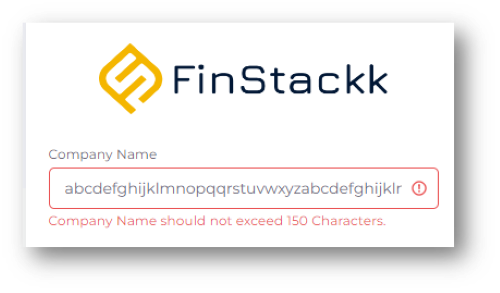

- Please make sure that you spell your company name correctly and without any typos. Any errors or misspellings could result in delays or difficulties in identifying your company on our platform.

- Once you have entered your company name in the "Company Name" field, you can proceed to the next step of the registration process by filling out the remaining required fields, including your first name, last name, email address, and password.

                                 

**Step 3:** Fill in the First Name

- The "First Name" field is a required field, and you must enter your first name correctly to complete the registration process. Please ensure that you enter your first name without any errors or mistakes to avoid any issues with your account in the future.

- The maximum length for the "First Name" field is 150 letters, which does not accepts any punctuation marks, and other special characters. If your first name exceeds this limit, please try to abbreviate or shorten it to fit within the required limit.

- Please double-check the spelling of your first name before submitting the registration form to avoid any typos or errors.

- If you are registering on behalf of a business or organization, please enter the first name of the authorized representative or contact person who will be using the account on behalf of the company.

- Once you have entered your first name in the "First Name" field, you can proceed to the next step of the registration process by filling out the remaining required fields, including your last name, email address, and password.

                     
**Step 4:** Fill in the Last Name

- The "Last Name" field is a required field, and you must enter your last name correctly to complete the registration process. Please ensure that you enter your last name without any typos or errors to avoid any issues with your account in the future.

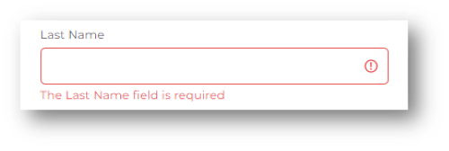

- The maximum length for the "Last Name" field is 150 letters, which does not undertake punctuation marks, and other special characters. If your last name exceeds this limit, please try to abbreviate or shorten it to fit within the required limit.

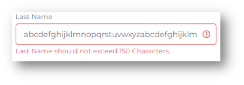

- Please double-check the spelling of your last name before submitting the registration form to avoid any typos or errors.

- If you are registering on behalf of a business or organization, please enter the last name of the authorized representative or contact person who will be using the account on behalf of the company.

- Once you have entered your last name in the "Last Name" field, you can proceed to the next step of the registration process by filling out the remaining required fields, including your email address, password, and confirmation of the password.

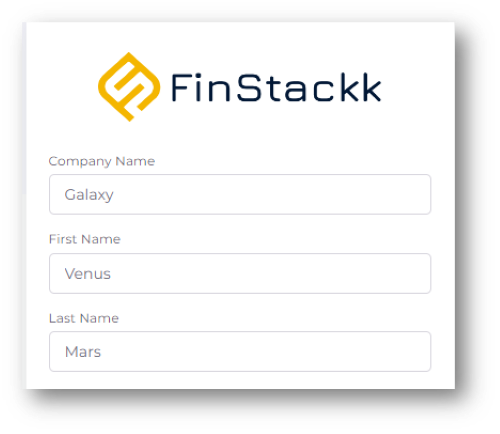   

**Step 5:** Select Plan Category

- The "Select Plan Category" step in the signup process allows you to choose the category that aligns with your business goals and requirements. 

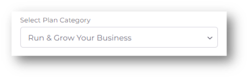

- The available plan categories typically reflect different stages or objectives of business growth, such as "Run and Grow Your Business." 

- Consider your business size, industry, budget, and specific needs when selecting a plan category. This ensures that you have access to the right tools and resources to support your business growth and success.

- Once you have selected a plan category, you can proceed to the next step of choosing a specific plan within that category.

**Step 6:** Select Plan

- The "Select Plan" allows you to choose a suitable plan based on your business needs.

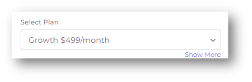
                                    
- Consider your budget and the value you expect to receive from the plan when making your selection. Some plans may offer the flexibility to upgrade or downgrade as your business grows. 

- From the available plans within your chosen category, select the plan that suits your business needs. The plans may have different features, pricing, and benefits.

- The available plans could include options like "Growth $499/month," "Premium $799/month," or "Essentials $299/month."

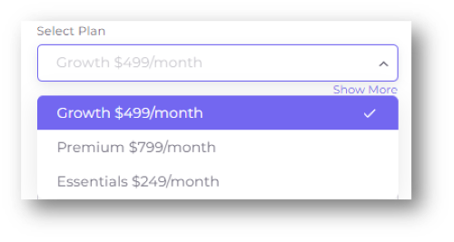
          
- If you would like to see more plan details, click on the “Show More” link. This will expand the detailed plan list for you to choose from. Different plan options are available, each with its own set of features, pricing, and benefits. Carefully review the details of each plan, including its functionality, scalability, pricing, and available support.

    
- Once you have selected a plan, click on it to proceed to the next step of the registration process.

                                  
**Step 7:** Fill in the Email Id

- The "Email Id" field is a required field, and you must enter a valid email address to complete the registration process. Please ensure that the email address you enter is accurate and valid as it will be used to send important communication and updates.

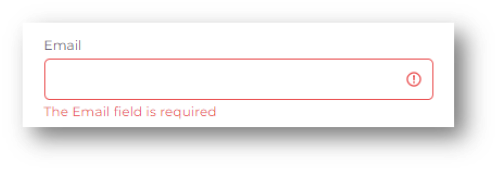

- It is recommended that you use a personal email address if you are an individual user and a work email address if you are representing your company.

- Please ensure that you enter your email address correctly to avoid any issues with account verification or communication with our support team. If you enter an incorrect email address, you may not be able to access your account or receive important communication from us.

- Please make sure that you have access to the email address you provide for the Two Factor Authentication, where it is essential when you Login into your account after successful registration. 

- Once you have entered your email address in the "Email Id" field, please confirm that it is correct before proceeding to the next step of the registration process by filling out the remaining required fields, including your password and confirmation of the password.

                          

**Step 8:** Fill in the Password

- The "Password" field is a required field, and you must create a strong and secure password to protect your account from unauthorized access. Please ensure that your password meets our security standards to avoid any issues with account security in the future.

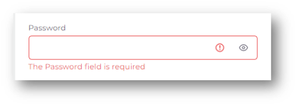
                 
- A strong password should be at least 6 characters long and include a mix of uppercase and lowercase letters, numbers, and symbols. Avoid using common words or phrases, as they are easier for guess.

- Please ensure that you enter your password correctly and securely, and do not share your password with anyone. We will never ask you for your password, and if you receive any suspicious communication asking for your password, please report it to our support team immediately.

- If you forget your password, you can reset it by clicking on the "Forgot Password" link on the login page. You will need to provide your email address to reset your password.

- Once you have created a strong and secure password, please confirm that it is correct before proceeding to the next step of the registration process by filling out the remaining required fields, including confirmation of the password and agreeing to the terms and policies.

                   
**Step 9:** Re-enter the Password

- The "Re-enter Password" field is a required field, and you must enter your password again to confirm that you have typed it correctly. This ensures that you have entered the correct password and helps to prevent any typos or errors.

- Please ensure that you enter your password correctly in both the "Password" and "Re-enter Password" fields to avoid any issues with logging in to your account or accessing your personal information.

- If you notice any discrepancies between the two password fields, please retype your password carefully in both fields to ensure that they match.

                                      
- Please do not share your password with anyone, including our support team. We will never ask you for your password, and if you receive any suspicious communication asking for your password, please report it to our support team immediately.

- Once you have confirmed your password by entering it again in the "Re-enter Password" field, please proceed to the next step of the registration process by agreeing to the terms and policies.

                     

**Step 10:** Accepting Private Policy & Terms

- The "Agree to Terms and Policies" is required to successfully register your account, and you must read through the terms and policies carefully before checking the box to indicate that you have read and agreed to them.

- The terms and policies are designed to protect your rights and ensure that our service is delivered fairly and securely. We recommend that you read through them carefully and make sure that you understand all of the terms before proceeding.

- If you have any questions about the terms and policies, please feel free to contact our support team for clarification. We are always happy to help and can provide additional information or answer any questions you may have.

- By checking the box to indicate that you have read and agreed to the terms and policies, you are legally bound to abide by the terms and policies outlined in the agreement. Please ensure that you understand the terms and policies before proceeding.

- If you do not agree with the terms and policies, you will not be able to register for our service. If you have any objections to the terms and policies, please do not proceed with the registration process.

- Once you have read through the terms and policies and are satisfied that you understand and agree with them, please check the box to indicate that you have read and agreed to the terms and policies before proceeding to the next step of the registration process.

**Step 11:** Subscribe Your Account

- Finally, click on the "Subscribe" button to complete the registration process.

Congratulations! You have successfully completed the registration process, and your account has been created. You will be now redirected to your account verification page.

**Step 12:** Account Verification

- After the user is successfully created you will be prompted to enter a verification code to confirm your account.

- A verification code will be sent to the email address you provided during the sign-up process. Check your email inbox, including the spam or junk folder, for an email from our FinStackk.

- Retrieve the verification code from the email and enter it into the designated field on the sign-up page.

- Make sure to enter the verification code accurately, as it must match the code provided in the email as the OTP is required.

- If you did not receive the verification code within 30 seconds, you can click on the "Resend OTP" button to request another code. Double-check your email address to ensure accuracy.

- Once you have entered the correct verification code, click on the "Verify OTP" button to proceed with the sign-up process.

- If the verification code is valid and matches the one sent to your email, your account will be successfully verified.
       
Thank you for choosing our services. We look forward to serving you and helping you to achieve your goals. If you have any feedback or suggestions for us, please do not hesitate to let us know. We are always looking for ways to improve our services and better serve our customers.

### **2.2. Login**

Logging in to your account is an essential step to access the features and services offered by FinStackk. Once you have registered for an account, you can log in using your email ID and password. Logging in to your account ensures that your personal information and data remain secure and accessible only to you.

In this user manual, we will guide you through the login process for FinStackk. We will cover the steps involved in logging in, such as entering your email ID and password, and two-factor authentication for added security. Following these steps will ensure that you can log in to your account quickly and securely.

**Step 1:** Login Page

To log in to your account, you need to first visit the login page of FinStackk.

**Step 2:** Enter the Email ID

- When you try to log in to your account, you will be prompted to enter your email ID. It is important to note that your email ID is a required field, and you will not be able to log in without entering a valid email address. If you have forgotten your email ID, you may need to check the email address associated with your account or contact customer support for assistance.

- When entering your email ID, make sure that you use the correct email address that you used to register for the account. If you have multiple email IDs, double-check that you are using the correct one for this specific account. It is important to ensure that your email ID is entered accurately as it is used to verify your identity and send you important notifications and updates.

- Ensure that there are no typos or spelling errors in your email ID. Sometimes it can be easy to misspell or mistype an email address, which could result in not being able to log in to your account. It is also important to make sure that you use the correct capitalization and punctuation when entering your email ID.

- If you enter an incorrect or invalid email ID, you will not be able to log in to your account. This could be because the email ID you entered is not associated with any account or the email ID is mistyped. If you receive an error message indicating that your email ID is not valid, you should double-check that you have entered the correct email address, with the correct spelling and capitalization.

- If you are having trouble remembering which email ID you used to register for the account, you can try checking your inbox for any emails from FinStackk. Often, the email address that the emails are being sent to will be the same as the one you used to sign up.

- Once you have entered your email ID, double-check that it has been entered correctly before moving on to the password field. This will help ensure a smooth and secure login process.

**Step 3:** Enter the Password

- Entering the correct password is crucial to successfully logging in to your account. Make sure that you type in your password carefully, paying attention to any uppercase or lowercase letters, numbers, or symbols that may be a part of your password.

- If you enter an incorrect password, you will receive an error message indicating that the password is not valid. Make sure that you have entered the correct password, including any uppercase or lowercase letters, numbers, and symbols, without any typos before clicking on the "Sign In" button.

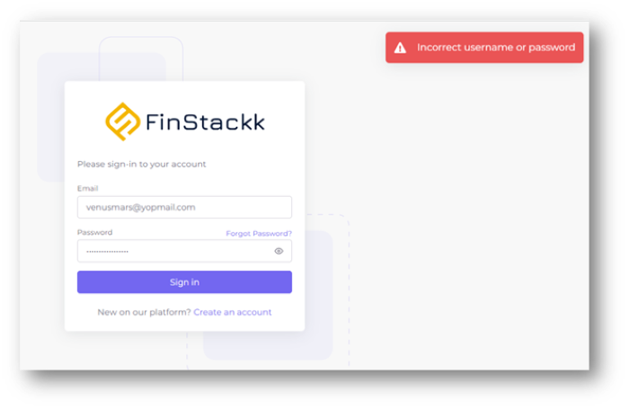

- If you repeatedly enter an incorrect password, you may be temporarily locked out of your account for security reasons. In such a case, you will need to wait for a specific period of time or follow the instructions provided on the login page to unlock your account.

- Make sure that you enter your password carefully and double-check that it is correct before clicking the "Sign In" button.

- It is important to keep your password confidential and not share it with anyone. Also, make sure that your password is unique and not used for any other accounts. This can help prevent unauthorized access to your account.

- After entering your correct email ID and password and clicking on the "Sign In" button, you will be directed to the Two Factor Authentication page where you will need to enter a code sent to your email to complete the login process. This provides an extra layer of security for your account.

- In case you have forgotten your password, you can click on the "Forgot Password" button on the login page so that you can reset the password for a smooth further login.

**Step 4:** Two Factor Authentication(2FA)

At FinStackk, we take the security of our users' accounts very seriously, and we are proud to offer 2FA as an option for our users. 

- Two-Factor Authentication, or 2FA, is an additional layer of security that helps protect your account from unauthorized access. With 2FA, you need to provide two forms of identification to log in to your account: your password and a verification code that is generated by a trusted device or application. This makes it much harder for someone to hack into your account even if they have your password.

- Two-factor authentication typically involves providing an additional verification code sent to your phone number after entering your password. This step ensures that only authorized users can access your account, even if your password is compromised.

- During the login process, you will be prompted to the 2FA setup method. A dropdown menu or a list of countries will be provided. You have to select your country from the available options and enter your phone number in the designated field, including the country code.

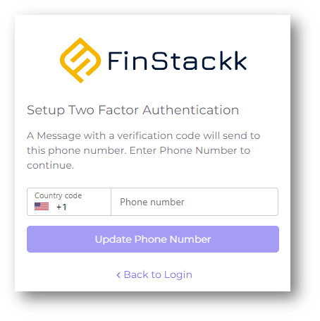

- The country code is a numerical prefix that identifies the country your phone number belongs to. It is usually represented by a "+" sign followed by the country code. For example, the country code for the United States is "+1", for the United Kingdom is "+44", and so on.

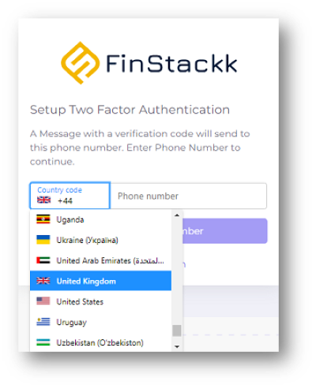

- Make sure to enter your phone number accurately, including any necessary area or regional codes.

- Once you have entered your phone number, click on the "Update Phone Number" button.

- A verification code will be sent to the phone number you provided via SMS or text message.

- Retrieve the verification code from your mobile device and enter it into the designated field on the 2FA page.

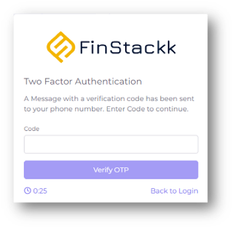

- If you did not receive the verification code, you can click on the "Resend OTP" button to request another code.

- Make sure to enter the verification code accurately. Once you have entered the correct verification code, click on the "Verify" or "Submit" button to complete the 2FA setup process.

- If the verification code is valid and matches the one sent to your mobile number, your 2FA setup will be successfully completed.

- You cannot use an invalid OTP. When entering the One-Time Password (OTP) during the verification process, please make sure you enter the correct code provided to you. If you enter an incorrect OTP, you will receive a message indicating that the OTP is invalid.

- From that point forward, whenever you log in to your account, you will be prompted to enter a verification code that will be sent to your registered phone number. 

If you have any questions regarding to your account login, please feel free to contact our customer support care. We are always ready to help you.

### **2.3. Overview of Dashboard**

The dashboard of our FinStackk is designed to provide you with a quick overview of your account and access to all the key features. With a side menu, you can easily navigate between different sections, including compliance, insights, reports, messages, and documents. The company section allows you to manage your company details, compliance, payments, and users. With this user-friendly layout, you can easily view and manage your compliance status, access important documents, and communicate with other users on the platform. You can also easily logout or access your settings from the dashboard. Our user-friendly design ensures that you can easily access all the features you need to manage your financial obligations efficiently.

The dashboard is the main interface, providing you with an overview of your financial activities. The side menu provides easy navigation to key features and functions, including compliance management, report generation, messaging system, and document storage.

- The compliance section of the dashboard allows you to manage your compliance obligations, tasks, and notices.

- Insights provide graphical representation for key financial data, including expenses, cash flow, sales, and customer information when integrated. These insights can be customized and filtered to focus on specific criteria such as time period and date. By utilizing these filters, you can analyze trends, identify patterns, and make informed decisions to drive business growth.

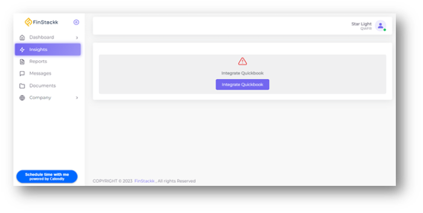

- The reports section provides you with the ability to generate detailed financial reports when integrated, helping you make informed business decisions.

- The messaging system enables communication between users, such as sending files or sharing important updates.

- The document storage section provides you with a secure and organized way to store and share important documents, such as financial statements or contracts.

- The company section of the dashboard includes details about your company, such as company information. The compliance section allows you to manage your compliance obligations at a company level. The payments section provides you with an overview of your payment history and current payment status. The users section allows you to manage the permissions and access levels of other users within the company.

- Finally, the logout and settings options provide you with the ability to securely log out of the website and manage your account settings, such as updating your password.

The dashboard in FinStackk provides you with a centralized and efficient way to manage your financial activities, helping you stay organized, compliant, and informed.

If you have any questions or concerns, we are here to support you. Contact us at any time, and we will try to improve your experience.

## **3. Features and Functions**

FinStackk offers a range of features and functions to help you manage your finances and make informed decisions. We strive to provide you with an intuitive and user-friendly interface that caters to all your financial needs. FinStackk is designed to assist you in managing your finances by providing you with various tools and resources. Whether you are a business owner, an individual, or a financial professional, we have something to offer to everyone. 

We offer integrations, insights, reports, tasks, compliance, notices, messages, documents as part of our features and functions in FinStackk. With our integrations, you can connect your accounts and manage your finances more efficiently. Insights gives you the graphical representation of data for more accessible view. Our reports provide you with detailed insights into your financial activities, allowing you to make informed decisions. The tasks feature allows you to create and manage tasks, assign them to team members, and track progress. Our compliance feature helps you stay on top of regulatory requirements and avoid penalties. The notices feature keeps you informed about important updates and deadlines, while the messages feature enables easy communication with team members and clients. Finally, the documents feature allows you to store and manage important documents securely. With these features and functions, our FinStackk offers a comprehensive solution to your financial management needs.

In this user manual, we will walk you through the different features and functions of FinStackk, and show you how to use them to their full potential.

### **3.1. Integrations**

Integration refers to the process of connecting different software applications or platforms, allowing them to communicate and work together seamlessly. It involves combining various systems, tools, and data sources to automate workflows, streamline processes, and improve productivity. Integrations can be built using APIs (Application Programming Interfaces) that enable different applications to share data and functionality, or through custom coding and middleware solutions. In the context of a financial based website, integrations may allow users to link their accounts with other financial services, import or export data to accounting software, or automate trading strategies using third-party tools.

With integrations, users can easily access a wide range of tools and services that are designed to help them manage their finances more efficiently. From accounting software and payment gateways to budgeting tools and investment platforms, integrations can provide users with a comprehensive set of tools to help them achieve their financial goals.

Integrations can provide a seamless experience for users. By integrating with other applications and tools, users can perform various tasks without leaving the website. This can save time and reduce the risk of errors that can occur when moving data between different applications.

Integrations are a powerful tool that allow different software applications to work together seamlessly, simplifying workflows and increasing efficiency. Integrations can be especially helpful for streamlining tasks such as accounting and document management.

At FinStackk, we understand the importance of integrations and have made it a priority to offer our users a range of options to choose from. Whether you're a small business owner looking for accounting software, an investor seeking access to real-time market data, or a freelancer in need of payment processing tools, our integrations can help you streamline your financial management and achieve greater success.

FinStackk offers seamless integration with QuickBooks and WorkDocs, two of the most popular cloud-based software solutions in the market. By integrating with these platforms, we provide our users with a highly streamlined and efficient experience that makes it easier to manage their finances and business operations.

                                  
- With our integration with QuickBooks, users can easily import their financial data and keep their books up-to-date without any manual data entry. This helps them save time and effort while ensuring that their financial records are accurate and reliable.

- On the other hand, our integration with WorkDocs enables users to collaborate and share files securely and seamlessly within their organization. Users can easily upload, access, and share their documents from anywhere, at any time, and on any device, making it easier for teams to work together and stay productive.

Overall, our integration with these powerful software solutions is designed to help our users achieve better results and make more informed decisions based on real-time data and insights.

**QuickBooks:**

QuickBooks is a popular accounting software package developed and marketed by Intuit. It is designed to help small and medium-sized businesses manage their financial operations more efficiently. QuickBooks allows users to track expenses, create and send invoices, manage payroll, and generate financial reports.
 
With its user-friendly interface and range of features, QuickBooks has become a go-to choice for many businesses looking to streamline their financial management processes. Many financial websites offer integrations with QuickBooks, allowing users to connect their financial data and seamlessly manage their finances from a central location.

QuickBooks offers dynamic dashboard configuration functionality that allows users to customize and personalize their dashboards based on their specific needs and preferences. Users can add or remove widgets, rearrange the layout, and adjust the size and position of each widget to create a dashboard that fits their unique workflow. The dashboard configuration options in QuickBooks include a wide range of widgets that can display various types of financial data, such as revenue, expenses, cash flow, and customer or vendor balances. Users can also add widgets to display key performance indicators (KPIs) that provide an at-a-glance view of their business's performance. 

As QuickBooks offers the dynamic dashboard configuration functionality you can save their custom dashboard layouts and switch between them depending on their current needs or tasks. This can save time and increase efficiency by allowing users to access the data and metrics that are most relevant to their current work without having to navigate through multiple screens or reports.

Additionally, QuickBooks has a robust ecosystem of third-party apps and add-ons, offering businesses even more tools and features to manage their finances. These integrations include time tracking tools, project management software, and more.

QuickBooks also offers integration with other software and services, allowing businesses to streamline their workflows and improve efficiency. These integrations include payroll processing, inventory management, and payment processing services. 

- In FinStackk, integrating with QuickBooks can provide you with a more comprehensive financial management solution, allowing them to track their finances, invoices, expenses all at one time.

- Integration of QuickBooks with FinStackk can help your businesses improve their financial operations and make informed financial decisions.

- You can easily export QuickBooks (QB) files from FinStackk in various formats such as PDF, CSV, and Excel. This allows you to conveniently generate and save your financial data in formats that best suit your needs for reporting, analysis, or integration with other systems.

- By integrating with QuickBooks, your businesses can automate financial tasks and reduce the likelihood of errors or inconsistencies in their financial records which saves you time.

               
**WorkDocs:**         

WorkDocs is a secure, fully managed, file collaboration and management service offered by Amazon Web Services (AWS). It provides a central place to store, share, and collaborate on files, making it easier for teams to work together and stay productive. WorkDocs offers features such as version control, file locking, and commenting, making it ideal for businesses that need to manage sensitive information and collaborate on projects in a secure environment. With WorkDocs, users can access files from anywhere, on any device, and can collaborate in real-time with their team members.

WorkDocs is a cloud-based document management and collaboration service. It allows users to store, share, and collaborate on documents and files securely in the cloud. With WorkDocs, users can easily create, edit, and share documents, as well as track changes and version history. Any type of file is accepted in WorkDocs like Microsoft Office files (documents, spreadsheets, and presentations), PDFs, web pages, images, and text files.

WorkDocs offers a range of features designed to improve collaboration, including the ability to create shared folders, control access to files and documents, and collaborate in real-time with colleagues. It also provides tools for commenting, reviewing, and approving documents, making it a great solution for team collaboration.

One of the key benefits of using WorkDocs is its security features. All data is encrypted in transit and at rest, and AWS ensures compliance with various industry standards and regulations, including HIPAA and SOC 2. WorkDocs also provides administrative controls for managing users, permissions, and data retention policies.

WorkDocs is a powerful tool for businesses and teams looking to improve collaboration and productivity, while also ensuring the security and confidentiality of their data.

- Integrating FinStackk with WorkDocs allows for easier collaboration and file sharing within the company. Users can upload and share important documents, such as financial reports, balance sheets, and invoices, with colleagues and clients in a secure manner.

- Integration of WorkDocs provides you several benefits to businesses and organizations, including secure document management, collaborative document editing, access from anywhere, version control.

- After integrating with WorkDocs in FinStackk you are allowed to access your documents from anywhere, on any device. This means that employees can work remotely, and still have access to all of the company's important documents and files. Additionally, WorkDocs offers powerful search capabilities, making it easy to find specific documents quickly and efficiently.

- By integrating WorkDocs in FinStackk, your company can streamline their document management processes and improve collaboration and productivity within their teams. It's a powerful tool that can help companies stay organized, secure, and efficient, while also improving communication and teamwork.

Overall, WorkDocs can help businesses to streamline their document management processes, improve collaboration and productivity, and ensure that their confidential information is kept secure.

We understand that integrating different software can be daunting at times, but we are here to help. If you have any questions or need assistance with the integration process, please do not hesitate to contact us. Our support team is always ready to assist you and make the process as smooth as possible.

### **3.2. Reports**

Reports are an essential feature that allows users to generate and view data-driven reports for various aspects of their financial transactions. These reports provide valuable insights into a company's financial health, enabling business owners and financial managers to make informed decisions about their financial strategy.

Each report offers a unique perspective on the company's financial performance, and users can choose the report that best suits their needs. The reports can also be customized with specific date ranges, filters, and sorting options to provide more targeted insights.

Reports take an important role in our FinStackk, which provides you with in-depth financial analysis and insights. The different types of reports available on FinStackk include Cashflow, Profit and Loss, Balance Sheet, Aged Payables, and Aged Receivables.

- If you want to take advantage of these reporting features, you will need to integrate FinStackk with Quickbooks. This integration will allow you to automatically import your financial data into our website, giving you access to powerful reporting tools that can help you better understand your financial situation.

Follow the process below for the best usage of our Reports Feature.

**Step 1:** Access the Reports

Log in to your account on FinStackk where you will be directed to Dashboard/Homepage. Then navigate to the Reports section from the dropdown menu of Dashboard from the side menu.

**Step 2:** Integrating with QuickBooks

To access the Reports feature that includes Cashflow, Profit and Loss, Balance Sheet, Aged Payables, and Aged Receivables completely, integrate with QuickBooks for better performance of your company.

- For your better understanding, we’ve used a Sandbox Company from QuickBooks to integrate as an example. It will help you with how the process goes on after integrating.

- After integrating with QuickBooks, FinStackk automatically sync’s the data related to the company chosen. Therefore, there is no need for you to generate each and every report as it automatically generates all Reports our FinStackk offers.

**Step 3:** Types of Reports

FinStackk has different types of Reports like Cashflow, Profit and Loss, Balance Sheet, Aged Payables, and Aged Receivables.

**Cashflow**

Cash flow is a financial statement that shows the cash inflows and outflows of a company during a specific period. The cash flow report is an important tool for managing a business's liquidity and tracking its financial health and its ability to meet its financial obligations. 

In the context of financial reporting, cash flow reports provide detailed information about the cash that a business has generated and how it has been used during a specific period, such as a month or year or a quarter. This can include cash receipts, cash payments, and net cash flow, which is the difference between cash receipts and payments. 

The cash flow report is an essential part of financial reporting and analysis, as it helps businesses understand their cash position and identify potential cash flow problems. It can also help businesses identify areas where they can improve their cash management and make better decisions about investing, financing, and operating activities.

With this feature, you can get a clear understanding of your cash inflow and outflow. You can use this report to identify patterns and trends in your cashflow, and to make informed decisions about how to manage your finances. Whether you're a small business owner or a financial professional, our cashflow report can provide valuable insights into your business's financial health.

- We at FinStackk offer cashflow in reports to make it easier for you to track the cash inflows and outflows of their business. With the cashflow report, you can see a clear picture of your business's financial health and make informed decisions based on the information presented. This report shows the cash movements within your business for a given period, including the opening balance, cash inflows from sales, investments, and other sources, as well as cash outflows for expenses, purchases, and other payments. By analyzing the cashflow report, you can identify potential cash flow issues, such as a shortage of cash to cover upcoming expenses, and take action to address them before they become critical.

- In addition, we have included a filter to help you focus on specific time periods or categories. The main benefit of the cashflow report and highlights the added functionality of the filter, which allows you to customize the view of the data.

- Filter provides options like date, date macro and summarize column by. You can filter it according to your needs from the given options and then click on Apply Filter for it to work and can also reset the filter to default.

                  
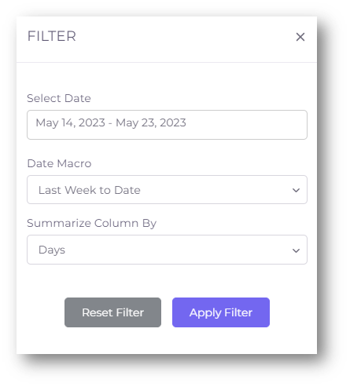

**Profit And Loss**

Profit and loss (P&L) is a financial statement that summarizes the revenues, costs, and expenses incurred by a business during a specified period. This report shows how much revenue a company has generated and how much it has spent on operating expenses. The difference between the revenue and expenses is the profit or loss that the company has made during the period.

The P&L report is typically generated on a monthly, quarterly, or annual basis, depending on the user's preference. The report can be customized to show data for specific time periods, and it may include comparisons with previous periods to provide a sense of how the business is performing over time. The P&L report can also be segmented to show performance by department, product, or service, allowing users to identify areas of strength and weakness in their business.

The Profit and Loss report is also known as the income statement or statement of operations. The report provides valuable insights into the financial health of a business and helps in making informed decisions. It lists all the revenue earned by a business from its operations, such as sales of products or services.

The Profit and Loss report also includes the cost of goods sold, which is the direct cost incurred in producing or purchasing the products or services sold. Additionally, it lists all the expenses incurred by a business in running its operations, such as rent, utilities, salaries, and taxes. By analysing the Profit and Loss report, businesses can identify trends, forecast future earnings, and make informed financial decisions.

- FinStackk provides with Profit and Loss in Reports for you to have a comprehensive overview of your business's financial performance. This feature allows you to track your revenue and expenses over a specific period and generate a report that highlights your net profit or loss. With Profit and Loss reports, you can quickly identify areas where you can reduce costs, increase revenue, and improve your business's overall financial health. This feature provides valuable insights into your business's profitability and helps you make informed financial decisions.

- Our Profit and Loss report also come with a useful filter feature, allowing you to easily view specific date ranges or select a specific option for specific performance across multiple periods. 

- Filter provides options like accounting method, date, date macro and summarize column by. You can filter it according to your needs from the given options and then click on Apply Filter for it to work. You can also reset the filter to default.

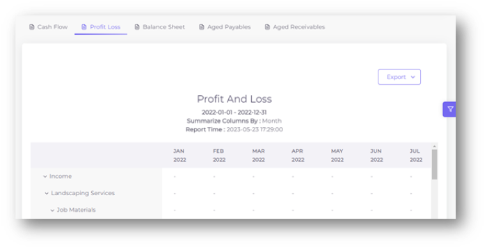

**Balance Sheet**

A balance sheet is another important report that provides an overview of a company's financial position at a specific point in time. It lists the company's assets, liabilities, and equity, providing a snapshot of what the company owns and owes. 

The balance sheet is divided into two sections: the assets section, which lists the company's assets in order of liquidity, and the liabilities and equity section, which lists the company's liabilities and equity in order of maturity. 

Assets are the things the company owns that have value, such as cash, investments, property, and equipment. Liabilities are the debts and obligations the company owes, such as loans, accounts payable, and taxes. Equity represents the residual interest in the assets of the company after deducting liabilities. It includes things like retained earnings and common stock.

A balance sheet is useful because it provides an overview of a company's financial health and can be used to evaluate its ability to pay its debts and meet its financial obligations. It can also be used to identify trends and changes in a company's financial position over time.

- We at FinStackk offer you a Balance Sheet in reports to get a better understanding of your company’s financial position. With our balance sheet report, you can quickly view your company’s assets, liabilities, and equity at a specific point in time. This feature allows you to make more informed decisions and better manage your business’s financial health. With this report, you can quickly see where your business stands and make informed decisions about future investments or financing options.

- Additionally, we provide the option to filter the report by accounting method, date, date macro and summarize column by, to get more detailed insights into your finances. You can filter it according to your needs from the given options and then click on Apply Filter for it to work and can also reset the filter to default.

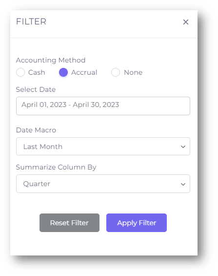

**Aged Payables**

Aged Payables is a report that provides information on outstanding bills that need to be paid to vendors or suppliers. It shows how much money is owed to each vendor and how long the payment is overdue. This report helps businesses to manage their accounts payable by identifying outstanding debts that need to be paid and prioritizing payment based on the due date. Aged payables report is an essential tool for businesses to manage their cash flow effectively and maintain good relationships with their vendors.

Aged Payables report is useful for keeping track of how much money is owed and to whom, and helps to ensure that payments are made on time to avoid late fees or other penalties. The aged payables report typically categorizes outstanding payments by the number of days past due, such as 30 days, 60 days, or 90 days. This allows the company to prioritize payments and address any outstanding issues with vendors.

In addition to the Vendor name and outstanding balance, the aged payables report may also include details such as the invoice number, invoice date, and due date. This information can be helpful in resolving any discrepancies or issues with payments. Aged Payables report is suitable as a reporting tool which helps businesses stay on top of their accounts payable and manage their cash flow effectively.

- We understand that managing payables is crucial for any business, and that's why FinStackk provides you with Aged Payables in Reports. This feature allows you to track the money you owe to your vendors and suppliers in a clear and organized manner.

- Additionally, we offer a filter option that enables you to customize the report according to your specific needs, making the process even more efficient and effective.

- Filter provides options like date macro and aging method (additional date field is given if report date is selected). You can filter it according to your needs from the given options and then click on Apply Filter for it to work. You can also reset the filter to default.

**Aged Receivables**

Aged Receivables is a financial report that shows the unpaid invoices owed to a company by its customers. It helps businesses keep track of the payments that are overdue, due in the current period, and due in the future. This report is useful for businesses to manage their cash flow, identify delinquent accounts, and follow up with customers who owe them money. The Aged Receivables report can be generated based on various criteria such as customer name, invoice date, due date, and payment status.

Aged Receivables report provides a detailed overview of all the unpaid invoices and how long they have been outstanding. The report typically categorizes the invoices based on their age, such as 30 days, 60 days, 90 days, or more. This information is crucial for businesses as it helps them keep track of their cash flow and manage their outstanding receivables.

By generating an Aged Receivables report, businesses can identify the customers who have not paid their invoices on time and take appropriate measures to recover the outstanding payments. They can also use this report to analyse their billing and collection practices and make improvements if necessary. Additionally, this report can help businesses predict their future cash flow by estimating the amount of money they are likely to receive from outstanding invoices in the coming days or weeks.

- FinStackk can provide you with aged receivables in reports to help you better manage your outstanding invoices and track your customers' payment history. This report allows you to see which customers owe you money and how long the payment has been outstanding.

- With the added filter feature, you can easily view aged receivables by date macro and aging method (additional date field is given if report date is selected), giving you more control and flexibility in managing your accounts receivable. You can filter it according to your needs from the given options and then click on Apply Filter for it to work and can also reset the filter to default.

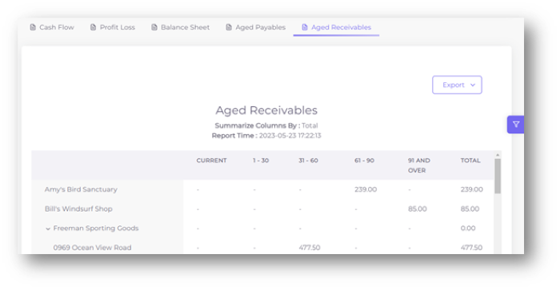

- You can export other important financial reports, including the Cash Flow report, Profit and Loss statement, Balance Sheet, Aged Payables report, and Aged Receivables report. Exporting these reports allows you to analyze and share your financial data in various formats, such as PDF, CSV, or Excel, providing you with flexibility and convenience.

- Locate the specific report you want to export, such as Cash Flow, Profit and Loss, Balance Sheet, Aged Payables, or Aged Receivables. Click on the 'Export' button associated with the report. Choose the desired export format, such as PDF, CSV, or Excel.

Hence, reports are a powerful tool that can help businesses stay on top of their finances and make informed decisions. They can help business owners and accountants make informed decisions by analysing data and trends.

If you have any questions or need assistance with using the reports feature on our FinStackk, please do not hesitate to contact our support team. Our customer support team is available 24/7 to assist you with any questions or concerns you may have.

### **3.3. Tasks**

Tasks refer to the actions that need to be completed by the user or assigned to others to ensure smooth financial operations. Tasks can range from simple tasks such as paying bills to more complex tasks such as tax filings or compliance tasks. These tasks may include things like monthly tasks, yearly tasks, paying bills, preparing financial statements, and more. The tasks feature helps users stay organized and on top of all the tasks that need to be completed.

Tasks are an important feature that helps to keep track of various tasks that need to be performed in a timely and efficient manner. Tasks can be assigned to specific team members or groups, and the task owner can set a due date for the task to ensure timely completion. The incorporation date and periodicity of the task can also be specified to ensure that the task is performed on a regular basis.

At FinStackk, we provide a comprehensive task management system to help you stay on top of your important deadlines and responsibilities. Our task management system allows you to easily create and manage tasks for various compliance requirements, such as filing tax returns, submitting financial statements, and meeting other regulatory requirements. You can assign tasks to different team members and set periodicity, incorporation date, and due dates to ensure timely completion. Our system provides a dashboard view to track progress and completion status of tasks. By using tasks in FinStackk, you can stay organized and on top of important tasks, ensuring that nothing falls through the cracks.

- Tasks are an essential aspect of financial compliance, and as an Admin, one will need to stay up to date on all the necessary tasks. Admins will create, assign, and monitor tasks on FinStackk.

Tasks are a vital part of FinStackk, as they help users stay organized and ensure that important work is completed on time. We understand that staying on top of your tasks and deadlines can be a daunting challenge, which is why we offer a user-friendly task management system that simplifies the process. Here is a guide 
on how to use tasks in FinStackk:

**Step 1:** Accessing Task Through Admin Login

Login with the Admin credentials into the FinStackk, you will be directed to Dashboard. Then navigate to Task option by clicking on Admin dropdown from the side menu.

          

  

**Step 2:** Creating A New Task

You can create a new Task by clicking on “Add New Task” button. You will be navigated to a dialog box named Add Task.

  

- **Task Name:** When creating a task, start by giving it a descriptive and informative name. This will help you and other users easily identify what the task is about. For example, "Pay Rent" or "Tax Filing".
- **Periodicity:** Next, choose the frequency at which the task needs to be completed. This could be Yearly, Quarterly, Monthly, Onetime, Biweekly and Semi-annual, or any other frequency that suits the task.
- **Description:** Provide a clear and concise description of the task. This will help you and other users understand the purpose of the task and what needs to be done.
- **Incorporation Date:** This refers to the task’s incorporation date. You can choose either yes or no.
- **Due Days:** Specify the number of days before or after the incorporation date by which the task needs to be completed. 

Once details are filled, click on Add button and task has been created, it will appear in the task list with the task name, due date, description, periodicity, and incorporation date. You can also edit and delete your tasks using Action section.

With the task management feature, you can assign them to specific team members, and set due dates. This ensures that everyone is aware of their responsibilities and that the tasks are completed within the given timeframe. Additionally, the due days for each task can be set, allowing to plan ahead and stay on top of the obligations. 

Whether you're having trouble creating tasks or if there are any questions related to the task feature, we're here to help. You can reach our support team and we'll do our best to provide you with prompt and helpful assistance.

### **3.4. Compliance**

Compliances refer to the set of rules and regulations that companies must follow to ensure that they are operating legally and ethically. In the financial world, there are various compliances that companies must adhere to, such as tax regulations, labor laws, and data protection regulations. Failure to comply with these regulations can result in hefty fines and damage to a company's reputation. To help companies manage their compliance obligations, many financial based websites, offers compliance management tools that allow them to track and manage their compliance requirements. These tools can help companies stay on top of their compliance obligations and avoid costly penalties.

Compliance is a crucial aspect of financial management, and it involves adhering to regulatory requirements and industry standards. One should offer features that allow users to manage and track their compliance obligations easily. Compliance is important for businesses as it helps them avoid legal issues, reputational damage, and financial losses. Compliance can refer to a number of different areas, such as financial reporting, data security, privacy laws, and anti-money laundering regulations.

We offer compliances in our FinStackk to help you stay compliant with the relevant laws and regulations. Our compliance module provides you with a comprehensive list of compliance requirements based on the type and entity of your business. 

- Admin will be in charge of managing compliances in the FinStackk. This includes creating and assigning compliance tasks to relevant team members, monitoring their progress, and ensuring that all necessary documentation is up to date and readily available. The compliance module is designed to help admins streamline these processes and stay on top of all regulatory requirements. It provides a centralized location to track compliance activities and store compliance-related documents, making it easier to maintain compliance and reduce the risk of penalties or legal issues.

Compliances are a crucial aspect of FinStackk, and as an administrator, it's important to manage and keep track of all compliances to ensure that the website is compliant with relevant regulations and laws. Here is a user manual for managing compliances from an admin perspective:

**Step 1:** Accessing Compliance Feature Through Admin Login

Login with the Admin credentials into the FinStackk, you will be directed to Dashboard. Then navigate to Compliance option by clicking on Admin dropdown from the side menu.

**Step 2:** Creating A New Compliance

You can create a new Compliance by clicking on “Add New Compliance” button. You will be navigated to a dialog box named Add Compliance.
          

- **Compliance Name:** This refers to the name of the compliance that needs to be followed. For example, a compliance name can be "Annual Filing of Tax Returns."
- **Type:** This refers to the type of compliance. It can be Federal, State, City, County.
- **Entity Type:** This refers to the type of entity that needs to comply with the given compliance. For example, it can be a limited liability company (LLC), a partnership, or a corporation. Other options include INC, Firm, All.
- **Category:** This refers to the category of the compliance. For example, it can be a tax or corporate.
- **Sub Category:** This refers to the sub-category of the compliance. It can be Income tax, Franchise tax, Annual return, Payroll, Sales tax, County BPOL tax, County Property tax, City, County.
- **Periodicity:** This refers to the frequency at which the compliance needs to be followed. For example, it can be Yearly, Quarterly, Monthly, Onetime, Biweekly and Semi-annual.
- **Incorporation date:** This refers to the compliance incorporation date. You can choose either yes or no.
- **State:** This refers to the state in which the compliance needs to be followed.
- **County:** This refers to the county in which the compliance needs to be followed.
- **City:** This refers to the city in which the compliance needs to be followed.
- **Due Days:** This refers to the actual due days for the compliance.
- **Extended Days:** This refers to the number of days by which the due date can be extended.
- **Relevant Act:** This refers to the act or law that governs the compliance.
- **Section/Rule:** This refers to the section or rule under the relevant act that governs the compliance.

After providing these details, click on Add button and the compliance is created. The compliance module in FinStackk can help companies track and manage their compliance obligations efficiently. You can also edit and delete your compliances using Action section.

**Step 3:** Import A Compliance

Apart from adding a compliance you can also import a compliance. You can click on Import Compliance button to import your own compliance. For better understanding you can download our sample compliance template from the import compliance dialog box. 

In summary, compliance is a crucial aspect of any financial field, and it involves following regulations, laws, and best practices to maintain the integrity and trust of the business.

If you encounter any issues or have feedback for us, please don't hesitate to contact our support team. We are always ready to help and provide you with the best possible assistance. Our goal is to make using our FinStackk as easy and intuitive as possible

### **3.5. Notices**

Notices are an important feature of FinStackk that can help users stay on top of important tasks and deadlines. It enables users to manage tasks, reminders, and deadlines. It helps individuals and businesses stay organized and up-to-date with their financial tasks, such as tax filings, invoices, and payments. Notices provide a centralized platform for managing tasks and monitoring their progress, allowing users to work more efficiently and effectively. It is an excellent tool for both individuals and businesses to ensure timely and accurate completion of financial tasks.

Notices are a valuable tool for keeping track of important tasks and deadlines, ensuring that users stay on top of their responsibilities and avoid missing important deadlines. The ability to assign notices to specific users or teams can also help to ensure that important information is communicated effectively and efficiently.

A Notice in FinStackk typically includes information such as the notice name, status, due date, assignee and a brief description of what the notice is about. They can also allow for the attachment of relevant files to the notice.

- The notice name typically provides a brief description of what the notice is about, such as "Tax Filing Deadline" or "Annual Report Due." The status of the notice indicates whether it is completed, working, received. The due date is the date by which the notice must be completed, while the assignee is the person responsible for completing the notice. File Uploading is a place where you can choose a file for your notice to work accordingly. The notice description provides additional details about the notice, such as specific tasks that need to be completed or important information that should be considered.

Notices can typically be accessed through a dedicated section or page on FinStackk, where you can view and manage your notices. 

**Step 1:** Accessing the Notices Feature

To access the Notices feature, log in to your account in FinStackk and click on the Compliance tab from the Dashboard dropdown on the side menu. Then you can click on “Notices” tab to navigate to Notices page.

**Step 2:** Creating a New Notice

To create a new notice, click on the "Add New Notice" button. You will be prompted to a new dialog box where you have to enter the Notice Name, Status, Due Date, Assignee, and Notice Description. Fill in the required fields and click on the "Add" button.

- **Notice Name:** Enter a descriptive name for the notice.
- **Status:** Select the current status of the notice (e.g., received, working, completed).
- **Due Date:** Enter the due date for the notice.
- **Assignee:** Select the person or team responsible for the notice.
- **Notice Description:** Enter a detailed description of the notice.

           

**Step 3:** Uploading Files

You can upload relevant files or documents related to the notice by clicking on the "Upload Files" button. You can upload multiple files and also drag and drop them into the uploader. Note that the size of the file should not exceed 500MB. Uploading files for Notices is an optional step, and you can skip it if you don't have any files to upload.

- The types of documents that can be attached to notices include spreadsheets, and word processing documents. It's important to refer to the documentation or support resources for the FinStackk in question to determine the supported document types for notices.

- After successfully creating a Notice with all details as in Step 2 and with a file attached you can click on “Add” button to Add a New Notice in the Notice Section. You will also receive a notice successfully created message.

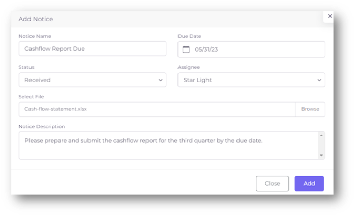

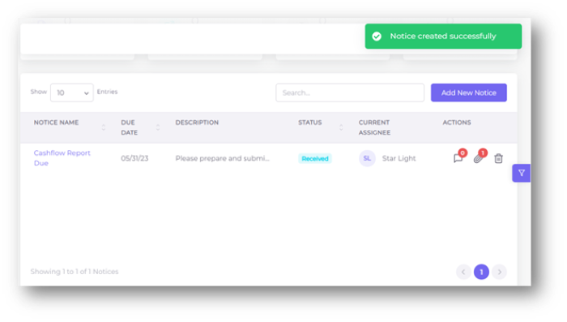

**Step 4:** Filtering Notices

You can filter notices by status, assignee, and due date to find the information you need quickly. Use the Filter icon on the right of the page to select the filter criteria.

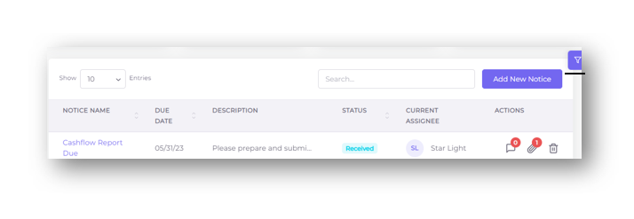
              

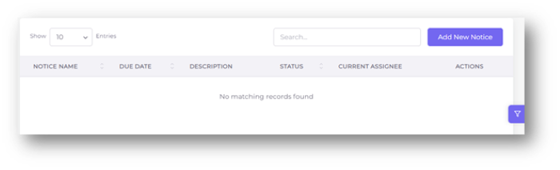
                                      
- You can also reset the Filter to return to its default state.

**Step 5:** Commenting, Editing and Deleting Notices

- To comment, edit or delete a notice, click on the notice in the list and then click on the "Comment" or "Delete" button. You can edit any of the fields you previously entered and upload or delete files as necessary and you can also comment on the notices.

- Editing and commenting on notices allows you to update or provide additional information to the notice, while deleting notices allows you to remove the notice if it's no longer relevant or necessary.

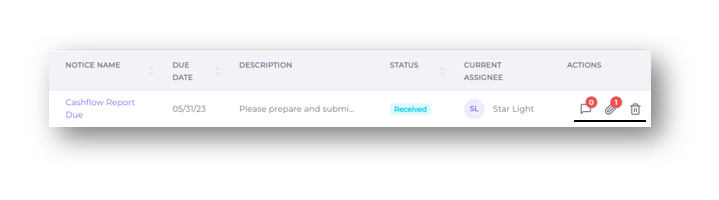

- To comment on a notice, simply locate the notice you want to comment and click on the "Comment" button. This will open the notice details page where you can comment on the notice, this will allow you to add your comments and share your thoughts with other team members or stakeholders and it also allows you to delete, edit your Comment. You can also edit the notice like description, status, and assignee. Once you're done making changes, click the "Save" button to update the notice. Note that Name of the Notice and Due Date cannot be changed.

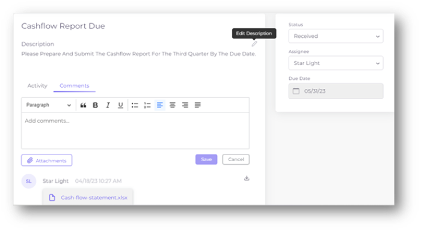     

        

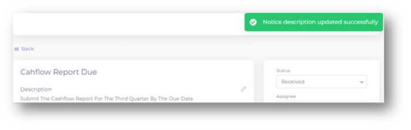

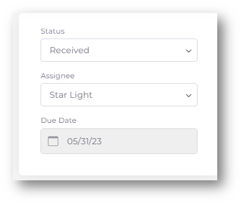
 
           

        
- You can also see the activity of your Notice in the Activity tab.

                
- To delete a notice, locate the notice you want to delete and click on the "Delete" button. A confirmation message will appear asking if you're sure you want to delete the notice. Click "Yes" to confirm, and the notice will be removed from the system.

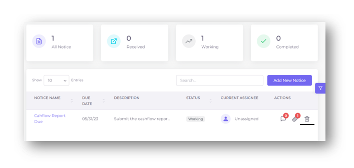

- It's important to note that once a notice is deleted, it cannot be retrieved, so make sure you really want to delete it before confirming. Additionally, only the user who created the notice or has admin privileges can edit or delete it.

We hope this user manual helps you use the notices feature effectively in FinStackk. If you have any further questions or need assistance, please don't hesitate to contact our support team.

### **3.6. Messages**

Messaging is an essential communication feature. In the context of FinStackk, messaging allows users to communicate with each other and exchange important information related to their business or financial transactions. This feature provides a convenient and secure way for users to collaborate and work together on projects, transactions, and other tasks.

The messaging feature in FinStackk typically offers a range of options for users to send messages, such as text messages, file attachments, and other files like Excel Sheets. Users can also organize their messages using filters to easily locate specific conversations, files, or other content. With these features, messaging can greatly enhance communication and collaboration within a company and facilitate smooth and efficient financial transactions.

The message chatting feature allows users to communicate with each other in real-time. Users can share messages, documents, and workdocs with each other using this feature. The chat messages are encrypted and secure to maintain confidentiality. Additionally, the messages can be filtered to easily find specific messages, documents, or workdocs.

By following these guidelines, users can make the most of the messaging feature and effectively communicate with their colleagues, leading to increased productivity and success.

**Step 1:** Accessing the Message Chatting Feature

To access the message chatting feature, log in to your account in FinStackk and you’ll be directed to dashboard/homepage and then navigate to the Messages option located on the side menu bar. Click on the option to open the message chatting window. This will take you to the main message chat window where you can start a conversation, if you are using the messaging feature for the first time.

  

- In addition to text messages, you may also have the option to upload files to your messages. This can be useful for sharing documents, spreadsheets, or other important files with your colleagues. You may also have the ability to filter your messages based on different categories, such as messages, documents, workdocs, or all. This can help you quickly find the information you need in your message history.

**Step 2:** Sending a Message

- To send a message, type the message in the text box located at the bottom of the chat window and press enter or click on the send button.

- In addition to sending text messages, you can also use the message chatting feature to upload files such as documents, images. To upload a file, click on the "Attach File" icon and select the file from your computer.

             

- If you want to send a file, click on the "Attach File" icon, you will then be prompted to a new dialog box naming Upload Docs and then select the file from your device and click on Upload button if not Cancel button. Note that the file size is restricted to 500MB and any file type is allowed. 

   

   

- You will be provided with options of Category to determine where this file falls into and you can choose accordingly.

   
            
   

- After clicking on the Upload button the document will appear in the chat history with a successful upload message.

- As a financial website, we encourage our users to communicate using clear and concise language when sending messages in the Message Chat Box. However, we also understand that sometimes it may be necessary to use special characters or symbols to convey certain information. Therefore, our chat box supports the use of special characters and symbols such as dollar signs ($), percentage symbols (%), and forward slashes (/) among others.

             

- Please note that while the use of special characters is allowed, we advise our users to use them sparingly and only when necessary. Additionally, it is important to ensure that the special characters used do not alter the intended meaning of the message being sent.

**Step 3:** Filtering Messages

- Users can filter messages by clicking on the filter button located on the top right corner of the chat window. The filter options include messages, documents, workdocs, and all. Selecting a filter option will only display the relevant messages, documents, or workdocs.

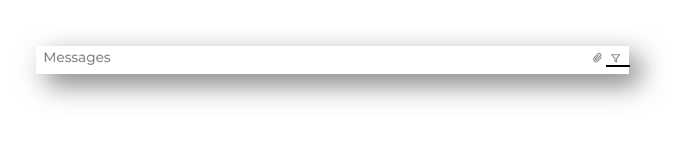   

- If you want to see only text messages in your chat history, click on Filter icon and then on Messages Option.

- Similary, if you only want see documents then click on the Filter icon and on Documents option.

- If there are no Documents/Messages/WorkDocs when one of the option is selected you’ll see an empty chat page. “All” option in the Filter icon shows you everything in your chat history.

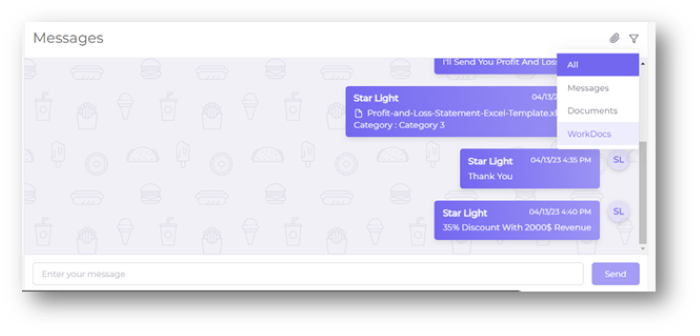

           
**Step 4:** Editing or Deleting a Message 
        
Users can edit or delete a message by hovering over the message and clicking on the edit or delete button. However, once a message is deleted, it cannot be retrieved.

- Editing or deleting a message is a simple process in the message chatting feature. If you want to edit a message you have already sent, simply hover over the message and click on the "Edit" icon. This will allow you to make any necessary changes to the message in a new dialog box known as “Edit Message”. Once you have made the changes, click on the "Update" button to update the message. Then you’ll receive a successful update message with an edited message in your chat box.

   

- If you want to delete a message, hover over the message and click on the "Delete" icon. You will be prompted to confirm that you want to delete the message. Once you confirm, the message will be deleted from the conversation history with a successfully deleted message and cannot be recovered.

- When deleting a message, it is important to note that the message may still be accessible through backups or other means. Therefore, it is important to use discretion when sending messages and only share information that is appropriate and authorized for the intended audience.

- It's also important to note that you may have limitations on how long you have to edit, delete a message after it's been sent.

In conclusion, the messaging feature is a valuable tool for communicating with other users on the FinStackk website. It allows for real-time communication and collaboration on important projects and tasks. Users can easily send messages, attach files, and filter through their messages to find specific information.

It is important to use proper etiquette and be professional when sending messages, as they are often used for work-related matters. Additionally, users should be mindful of the sensitivity of the information they are sharing and take appropriate measures to ensure the privacy and security of the messages.

### **3.7. Documents**

Welcome to the document management world of FinStackk! Our FinStackk features an intuitive and user-friendly document upload system. Say goodbye to the hassle of emailing documents back and forth or digging through your computer files. With our document feature, you can easily upload and organize all of your important files in one convenient location. Whether you're uploading client documents, financial reports, or legal forms, our feature is here to make your life easier. So, get ready to streamline your workflow and access your files from anywhere, at any time!

The documents feature on a FinStackk allows users to securely upload and share important files and folders. This feature is designed to streamline communication and collaboration between team members and clients.

The document management feature provides a secure and organized way to store, manage, and share these important files. With the document management feature, users can upload files and create new folders to a centralized location, making it easy to access and manage documents from anywhere.

Following the instructions mentioned below you can make the best use of the Documents feature on our FinStackk website.

**Step 1:** Accessing the Documents Feature

- To access the documents feature, you need to log in to your account which results in opening dashboard and then navigate to the Documents section which is available as an option in the side menu of the dashboard/homepage.

         

  

- Once you have accessed the documents page, you will be able to see the Documents section.

- From the documents page, you can also perform various actions such as uploading new files and adding new folders, renaming files, and deleting files or folders. These actions can help you organize and manage your documents effectively. You can also search your Documents using the Search Bar designed exclusively for the Document section.

**Step 2:** Uploading Files

- To upload a file, you can simply click on the "Upload File" icon and select the file you wish to upload from your device. 

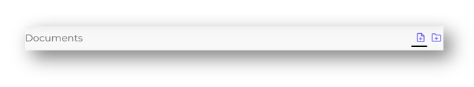           

- When you click on the "Upload File" icon, a tab will open where you can select or drop the file you want to upload from your device. You can browse your computer's file system to find the file you want to upload and can also select a Category in which you want your file to be. It’s important to note that the file size should not exceed 500MB. Once you have selected the file, you can click on the "Upload" button to start the upload process. 

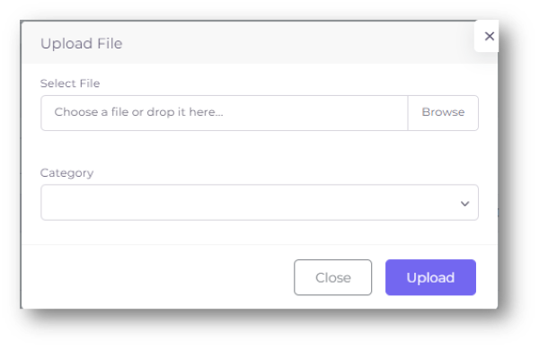                            

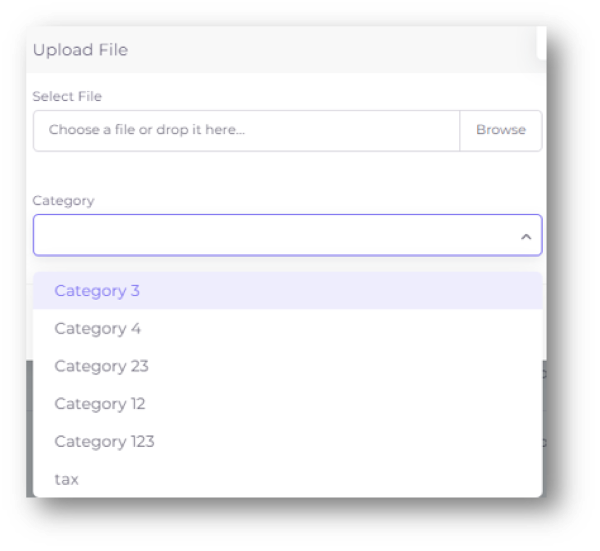       

- After uploading a file, you will receive a successfully uploaded message and then you can see your file in the Documents section. The time it takes to upload the file will depend on the size of the file (should be ≤ 500MB) and the speed of your internet connection. 
 
                        

   

- Any types of files can be uploaded. But make sure to follow the FinStackk guidelines and restrictions when uploading files.

**Step 3:** Adding Folders

- Adding a folder is very easy, except that you will create a new folder in the Documents. To add a folder, you will need to click on the "Add Folder" icon, which is located next to the "Upload File" icon.                              

- When you click on the "Add Folder" icon, a tab will open up prompting you to give a Name to the folder you want to add and its Category.

       

- Once you have named the folder and with the category chosen, you can click on “Add” button. Your folder will be created with a successfully created message and you can see it the Document section.

**Step 4:** Documents Actions

After you have uploaded files or added new folders to the documents feature, you will be able to see them listed on the page. Next to each document, there will be several options available to you under the “Actions” option in the Documents section like share, download, edit and delete.

- If a file is uploaded, you may be able to share, download, edit and delete your file.

 
- In the share option, a link will be generated then you can copy and share with others. This link will allow them to access the document that you have shared with them. Please note that you should only share links to documents with people who you trust, as the link provides access to the entire file.

                     

- You have the second option to download the file to your device by clicking on the download button. This will save a copy of the file to your computer or mobile device, which you can then access even if you are not connected to the internet.

- The third option is the edit button, which will allow you to change the name and category of the file. This can be useful if you have uploaded a file with the wrong name or if you want to move it to a different category. You will receive a successful message after you’ve uploaded the edited file and you can see your document with the edited name or category in the Document section.

                    
- The last option is the delete button, which you can use to remove the file from your documents. It will ask for your confirmation before deleting the file. After deleting the file you’ll get a successfully deleted message and you can also check if it’s deleted or not in your Document section. Be careful when using this option, as it cannot be undone and you may lose important files.

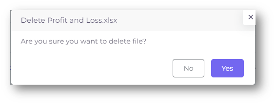 

- Unlike the options in Upload File, when you add a folder you may only able to edit and delete the folder.

   

           

- If you want to change the Category of the folder, you can choose Edit Folder option. You’ll be prompted to Edit Folder dialog box, where you can change the category. After editing click on Update button, then you will receive a successfully updated message and can see your edited folder in the Document section. Note that you can only change Category but not the Name of the folder.

- Similar to the delete option in the Upload File feature, you’ll have the same function in Add Folder feature, where you can use to remove the folder from your documents. A confirmation message will appear asking you to confirm the deletion. If you're sure you want to delete the folder, click "yes" to proceed. You’ll receive a message stating folder is deleted successfully. Once the folder is deleted, it will no longer appear in your documents list.

                        
In conclusion, the Documents feature is a valuable tool for organizing and sharing files. With the ability to upload files and create folders, as well as edit, delete, share, and download them, it provides a convenient and efficient way to store and access important documents. Whether you are working on a team or managing your own finances, the Documents feature can help you stay organized and on top of your files. So, make the most of this feature and streamline your workflow today. By leveraging this feature, users can streamline communication and collaboration, while also ensuring that sensitive information is kept secure.
                
Remember to also follow any guidelines or policies provided by your organization regarding the use of this feature. If you have any further questions or concerns, please don't hesitate to reach out to our customer support team for assistance.

## **4. Management**

Management is a fundamental component of any organization, from small businesses to large corporations. It involves planning, organizing, coordinating, and directing resources to achieve specific goals and objectives. Effective management is essential for businesses to operate efficiently and achieve success, and it requires a range of skills and tools to be effective. Management tools are designed to help businesses of all sizes streamline their operations, manage their resources, and achieve their objectives. 

### **4.1. User Management**

User management is a crucial aspect for any organization, as it involves managing the access and permissions of users who have registered on the platform. User management is typically handled by an administrator who has access to all user accounts and can assign different levels of permissions and access to different users. It allows the administrator to create and manage user accounts, grant or restrict access to certain features, and set user roles and permissions. This allows for greater control over who can access sensitive information or perform certain actions within the system. A well-designed user management system ensures that users have the appropriate level of access to perform their tasks while maintaining the security and integrity. 
 
User management refers to the processes and tools used to manage user accounts and permissions within the system. This includes creating new user accounts, updating user information, resetting passwords, and assigning different levels of access to different users.

FinStackk's user management provides you with a powerful yet simple tool to manage your organization's users efficiently. With our user management system, you can easily add, edit, or delete users, set up user roles and permissions, and assign tasks to individual users or groups.

- Our user management system is designed to be user-friendly, and it requires no special technical skills to operate. You can quickly create new user accounts and define user roles and permissions with just a few clicks. Additionally, you can set up different levels of access for each user or group, ensuring that sensitive information is kept secure and only accessible to authorized personnel.

- User management also allows users to manage their own profile information, such as name, contact details, and login credentials. This can include features like password reset and two-factor authentication to enhance security.

- FinStackk have a robust user management system to ensure security and compliance with regulatory requirements. This includes proper authentication and authorization controls, data encryption, and regular security audits to identify and address any vulnerabilities.

Overall, effective user management is essential for maintaining the security and integrity of a financial website, as well as ensuring that users have the appropriate level of access to perform their job functions.
In this user manual, we will go over the various features and functions of the user management system.

- **Accessing User Management:** To access the user management module, log in as an administrator and navigate to the User section in the Admin dropdown on the side menu.

- **Adding New Users:** To add a new user, click on the "Invite User" button and fill in the required information, such as the Email address, First Name, Last Name, Role.

- **Managing User Roles:** User roles determine the level of access and permissions for each user. The system may have pre-defined roles, such as "Admin" or "User," or you may be able to create custom roles. To manage user roles, navigate to the user roles section in the admin panel and create or edit roles as necessary.

- **Editing User Role:** To edit a user's role, locate the User in the user list and click on Action section. You should be able to edit their First Name, Last Name, Role.

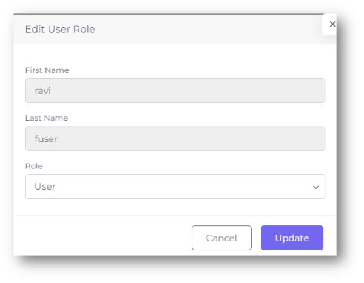

- **Forgot Password:** Forgetting your password can be a frustrating experience, but we have a "Forgot Password" option to help you reset your password and regain access to your account.

- To use this feature, click on the "Forgot Password" button located on the login page. You will then be prompted to enter the email address associated with your account in a new Forgot Password page. After entering your email address and clicking on “Send Reset Link” button, you will receive an email with instructions on how to reset your password. Follow the instructions carefully and create a new password for your account.

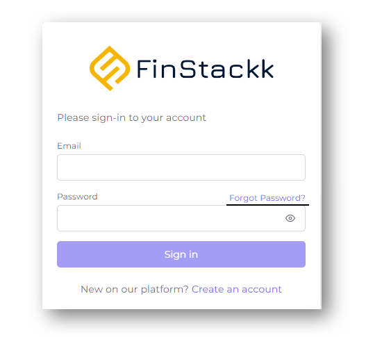

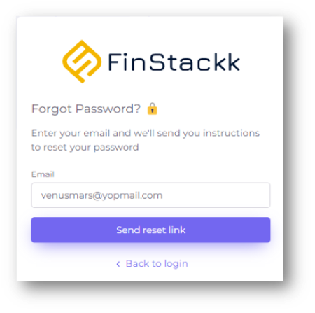
                               

- It is important to note that the password reset link sent to your email address will be valid for a limited amount of time. Therefore, it is recommended that you reset your password as soon as possible after receiving the email.

- If you click on the Reset Password link which is sent to your respective email id, you will be directed to a page where you can set your new password. When creating a password, ensure that it is strong and not easily guessable. A strong password typically contains a mix of uppercase and lowercase letters, numbers, and symbols. It is also recommended that you avoid using common words or phrases and use a unique password for each of your accounts to enhance the security of your information and then click on “Submit” button.

                         

- If you do not receive the password reset email, make sure to check your spam or junk folder. If you still do not see the email, contact the customer support team for further assistance. 

- After resetting the Password, you can click “Sign In” button on the Login page with your correct Email Id and new Password.
 

If you are having trouble accessing your account or resetting your password, it's recommended that you contact the customer support team of the website or application for further assistance. They will be able to guide you through the process and help you regain access to your account.

- **User Activity Logs:** The system may keep a log of user activity, such as last login. As an administrator, you should be able to view these logs to monitor user activity and ensure security.  We also offer two-factor authentication options, which can add an extra layer of security to the login process.

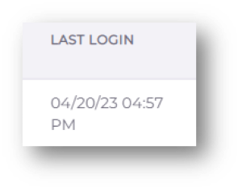

- **User Support:** Users may encounter issues or have questions about the system. As an administrator, you should be prepared to provide support and troubleshoot issues as needed. This may include offering a help desk or ticketing system for users to submit requests or issues.

Finally, user management can involve providing training and resources to users to help them effectively use the financial website and ensure compliance with relevant regulations and best practices. This might include online tutorials, user guides, or webinars. Overall, a well-designed user management system can help ensure the security and integrity by controlling access to sensitive information and preventing unauthorized activity.

In conclusion, user management is an essential component of FinStackk that wants to ensure proper security and control over the access to the platform. Remember to always keep your user information up to date and to regularly review and update your user management policies to ensure continued compliance and security.

### **4.2. Organization Management**

Organization management refers to the process of managing and organizing the financial data of an organization. It involves setting up and maintaining various accounts and records related to income, expenses, assets, liabilities, and other financial transactions.

An important aspect of organization management is maintaining records of financial transactions. This involves recording all transactions that occur within the organization, including sales, purchases, and payments. It's important to keep these records accurate and up-to-date to ensure that the organization's financial statements are correct.

Additionally, organization management involves tracking the organization's cash flow, managing budgets and forecasts, and ensuring compliance with applicable laws and regulations. It's also important to have proper internal controls in place to prevent fraud and ensure the accuracy of financial data.

Overall, effective organization management is essential for the success. It helps to ensure that the financial data is accurate, complete, and up-to-date, and that the organization is compliant with relevant laws and regulations. Organization management can be a useful tool for keeping track of important dates or deadlines related to your organization, such as tax filing dates, annual meetings, or contract renewals.

- Other features that may be included in organization management are reporting and analytics, which allow users to track and analyse their company's performance and metrics. This feature can provide valuable insights into the company's finances, sales, expenses, and other key performance indicators.

- It's important to keep your organization's information up-to-date and accurate in order to ensure smooth financial management and compliance with any relevant regulations or requirements. The organization management feature is designed to make this process as simple and streamlined as possible, allowing you to focus on other important aspects of running your organization.

- In organization management, you can create and manage multiple companies within a single account. This allows for greater flexibility in managing finances for multiple businesses or entities.

- Advanced organization management features include the ability to set up automated workflows, such as automatically generating reports.

- Robust reporting capabilities that allow users to generate custom reports based on specific criteria and filters.

- Seamless collaboration tools, including the ability to assign tasks and communicate with other users within the platform.

- Flexible data management options, including the ability to import and export data in a variety of formats and integrate with APIs.

Organization management is a crucial aspect in FinStackk, as it allows users to manage their company's details and structure. This feature usually includes the ability to add, edit, or delete company details such as the company name, address, and other relevant information.  It may also include the ability to create and manage different departments, teams within the company. 

Organization management systems in FinStackk also offer integrations with other financial software like QuickBooks and WorkDocs services, and an accounting software or payment processors. This can streamline the management of finances across different systems and reduce the need for manual data entry.

- To access organization management, you may need to log in as an administrator or have specific permissions assigned to their account. Once they have access, they can typically view and edit their company's information and structure.

- In addition to basic information, you can also manage user access and permissions. This allows you to control who has access to specific parts and what actions they are authorized to perform.

- Organization management also allows you to manage your billing and payment information, including updating your credit card or bank account information for automatic payments.

- In addition to managing company details, organization management may also include user management features, allowing administrators to add, edit, or delete user accounts, assign roles and permissions, and manage user access to different features and data or read-only access.

- Organization management in FinStackk has built-in security features, such as two-factor authentication.

Overall, organization management is an essential feature of FinStackk, as it allows users to manage their company's details, structure, and user accounts efficiently. It can also provide valuable insights into the company's performance, helping users make informed decisions about their finances and operations.

Organization management is an essential aspect, and we strive to provide a comprehensive and user-friendly solution for our clients.

If you have any questions or concerns about using FinStackk, please do not hesitate to contact our support team. Our support staff is available to assist you with any issues you may encounter while using our platform.

## **5. Troubleshooting and Support**

As with any technology platform, you may encounter issues or need assistance with certain functions while using FinStackk. This section of the user manual aims to provide guidance on common troubleshooting scenarios, as well as how to access and utilize support resources available to users. By following the steps outlined in this section, you can work to resolve issues quickly and efficiently, minimizing any potential disruption to their experience using the website.

### **5.1. Common Issues and Solutions**

When using any software or application, it is not uncommon to experience issues or encounter unexpected problems. In order to assist you with resolving such issues, it is important to have a troubleshooting guide available. This guide will outline common issues that you may experience, along with possible solutions or workarounds. Having this information readily available can help users save time and frustration, and ensure that they are able to use the software or application as intended. Some of the common issues and solutions are mentioned below:

- **Issue:** Unable to login to the website.
**Solution:** Verify that you are using the correct login credentials. If you have forgotten your password, use the "forgot password" feature to reset it. If the problem persists, contact customer support.

- **Issue:** Unable to view or download documents.
**Solution:** Ensure you are able to access the documents. Check that you are using a compatible browser and that your internet connection is stable. If the issue persists, contact customer support.

- **Issue:** Error message while making a payment.
**Solution:** Check that you have entered the correct payment details, including the amount and payment method. Ensure that your internet connection is stable. If the problem persists, contact customer support.

- **Issue:** Compliance deadlines are not reflecting accurately.
**Solution:** Check that the system is updated to the latest version. Verify that the compliance deadlines are correctly set up in the system. If not refer to the user manual or contact customer support.

- **Issue:** Unable to add or remove users.
**Solution:** Ensure that you have the necessary permissions to manage users. Verify that the user information is correctly entered and that all required fields are filled. If the problem persists, contact customer support

- **Issue:** Reports not generating or showing incomplete data.
**Solution:** Verify that the report parameters are correctly set up. Check that the data is updated in the system. If the problem persists, contact customer support.

- **Issue:** Unable to send or receive messages.
**Solution:** Check that you have access to send or receive messages. Verify that the message content is correctly entered and that there are no formatting errors. If the issue persists, contact customer support.

- **Issue:** Unable to access the website from a particular device or location.
**Solution:** Check that the device or location is compatible with the website requirements. Ensure that there are no network restrictions or firewalls blocking access. If the problem persists, contact customer support.

- **Issue:** Navigation problems.
**Solution:** If you are having trouble finding what you need on the website, refer to the user manual. If you still cannot locate the information you need, contact customer support for assistance.

- **Issue:** Security concerns.
**Solution:** If you have concerns about the security of your account or personal information, make sure to review the website's privacy policy. If you notice any suspicious activity, contact customer support immediately.

- **Issue:** Technical difficulties.
**Solution:** If you encounter any technical issues while using the website, such as slow loading times or error messages, try clearing your browser cache or using a different browser. If the issue persists, contact customer support.

### **5.2.  Getting Help and Support**

Despite our best efforts, there may be times when you encounter issues or need additional support while using our FinStackk. In such cases, we offer a variety of resources to help you troubleshoot and resolve any problems you may be experiencing. Our support team is always ready and available to assist you, and we provide a range of helpful materials, such as user guides and FAQs, to help you better understand our platform and its features. Below, you'll find information on how to contact our support team, as well as some tips and tricks for resolving common issues.

- If you have a technical issue with the website, you can reach out to our support team via [finstackksupport](https://operations@finstackk.com) or by phone at **+1(276) 221-0992**. Our support team is available 24/7 throughout the week and we also offer emergency support options outside of regular business hours for critical issues.

- For non-technical support inquiries, such as billing questions or general feedback, you can reach out to our customer service team by **+1(276) 221-0992**.

- If you're trying to troubleshoot an issue yourself, we recommend checking our FAQ section, which can be found on the dashboard. These resources contain a list of common issues and solutions, as well as step-by-step troubleshooting guides for specific problems.

Remember, providing a clear and detailed description of your issue or question will help our support staff provide the best and fastest assistance possible.

### **5.3. Product Updates and Maintenance**

At FinStackk, we are committed to providing you with the best possible user experience. That's why we regularly update our platform to ensure that it is running smoothly and efficiently.

During maintenance periods, you may experience some temporary downtime or limited access to certain features. However, we strive to schedule maintenance during off-peak hours to minimize any disruptions to your workflow.

We also frequently release product updates that include new features, bug fixes, and performance improvements. When a new update is available, you will receive a notification in your dashboard or via email.

We encourage you to keep your account up to date with the latest version to ensure you have access to all of the latest features and enhancements.
If you have any questions or concerns about product updates or maintenance, please don't hesitate to contact our support team for assistance.

## **6. Glossary**

This user manual includes a glossary and index to help users easily navigate and understand the financial terminology used throughout the website. The glossary provides definitions and explanations of key financial terms and concepts. We encourage users to refer to the glossary as needed to enhance their understanding and use of our financial website.

**Glossary of Finance and Accounting Terms:**

A glossary is a section of a document that provides a list of terms and definitions related to a specific subject or topic. A glossary can be a useful tool for users who may not be familiar with certain financial terms or concepts. It can also serve as a reference for users who want to quickly find the definition of a particular term without having to search for it elsewhere. By including a glossary in FinStackk user manual, you can better understand the language and terminology used in financial documents and reports, and have a clearer understanding of their financial activities. Below are some general financial terms which may be helpful.

- Balance Sheet - A financial statement that shows a company's assets, liabilities, and equity at a specific point in time.
- Expense - The cost of goods or services used or consumed by a company in the course of its operations.
- Liabilities - Obligations owed by a company, such as debt or accounts payable.
- Revenue - Income generated by a company from the sale of goods or services.
- Assets - Any resource owned by a company that has economic value and can be used to generate future economic benefit.
- Cash flow - The amount of cash and cash equivalents that flow in and out of a company during a specific period of time.
- Equity - The portion of a company's value that is owned by shareholders. It is calculated as total assets minus total liabilities.
- Fiscal year - The financial reporting period used by a company or government that does not coincide with the calendar year.
- Gross profit - The difference between revenue and cost of goods sold.
- Interest - The cost of borrowing money or the compensation paid to a lender for allowing the use of their money.
- Liquidity - The ability of an asset to be converted into cash quickly and easily without a significant loss in value.
- Compliance - Refers to the adherence to laws, regulations, and standards set forth by governing bodies and industry organizations.
- Aged Payables - a critical accounting document that summarizes the bills and invoices owed by a business, broken down by vendor and due date.
- Aged Receivables - A periodic report that categorizes a company's accounts receivable according to the length of time an invoice has been outstanding.
- Net Income - The amount an individual or business makes after deducting costs, allowances and taxes.

Thank you for choosing our FinStackk for your financial needs. We value your business and want to ensure that your experience with us is a positive one. We’re grateful to you for taking the time to read through our user manual. FinStackk is committed to providing the best possible user experience and we welcome any feedback you may have. 

We hope that this user manual has been helpful in guiding you through our platform's features and functionality and if you have any additional questions or feedback, please don't hesitate to reach out to our support team.

